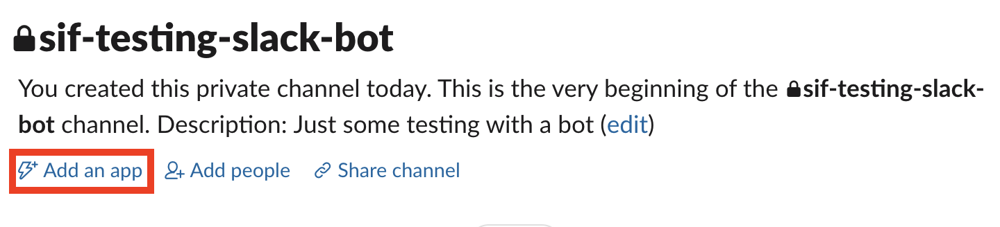

# Groundhog - WIP
 A simple decorator to get notified if there's an issue with your pre-alpha deployed code

## TL;DR
When running pre-alpha stage code, there isn't the time to properly build stable and error-proof code. When deployed (e.g. for concept validation tests in early product discovery), a code failing silently could mean losing valuable data. 

Groundhog provides a framework that can be easily added to existing code and push notifications to channels

## Install
Hold on, will be there soon :) 

## Usage

Follow this three steps process:
1) Initialize groundhog giving the name of the app that it's monitoring
2) Register a connector (Slack is included as a demo, but whatever class meeting requirements could work!)
3) Decorate a function with Groundhog

### Setting up a Slack app
Groundhog is designed for flexibility and accomodating user-defined connectors (more about this in the section below).

For this example, we'll use the SlackConnector included in the package defined at `groundhog/connectors/slack.py`.

To run the code below, you'll have to create an app and link it to a workspace so to receive notifications. To do so, follow these steps:
1) Follow this [tutorial from Slack](https://github.com/slackapi/python-slackclient/blob/master/tutorial/01-creating-the-slack-app.md) on how to create an app. Add the `chat:write` scope to the bot and note your `Bot User OAuth Access Token`, you will need it to initialize the connector.
2) Go to the channel where you want to receive the notifications and add your app to that channel

3) Run the code below by substituting your channel name and slack bot token.

``` python
import math

#TODO Change this into groundhog.connectors.slack 
from connectors.slack import SlackConnector
from groundhog import Groundhog

# tell Alan the groundhog what it's watching
# Why alan? https://www.youtube.com/watch?v=xaPepCVepCg
alan = Groundhog(app_name="Groundhog test")

# register a connector - Slack for example
CHANNEL = "#sif-testing-slack-bot" # the cannel name where you want to receive the notifications
SLACK_BOT_TOKEN = "YOUR SLACK BOT TOKEN"
alan.register_connector(SlackConnector,SLACK_BOT_TOKEN,CHANNEL)

# assign the sentinel to watch this function
@alan.watch
def failable_func(n):
    """Just a function that could easily fail with the wrong input"""
    math.sqrt(n)

# all good!
failable_func(4)

# doesn't look too good...
failable_func(-4)
```

### Writing your own connector
Gmail? Telegram? SMS? If you can code it, you can get your warnings on that channel! 

A generic connector is a Python class which implements a `nofity` method (the one sending the notification) taking as arguments `monitored_app_name`, `func`, `error`, `func_args` and `func_kwargs`.

For example:
```python
class MySMSConnector()
    def __init__(self,virtual_number,recipient_number,client_id,client_secret):
        """
        Initializes my sms connector

        ARGUMENTS:
        virtual_number (str): the virtual number sending the SMS
        recipient_number (str): the mobile number to be notified
        client_id (str): your SMS provider API client ID
        client_secret (str): your SMS provider API client secret
        """
        self.SMS_client = your_sms_library(client_id,client_secret)
        self.from_number = virtual_number
        self.recipient_number = recipient_number
    
    # the nofity method
    def notify(self,monitored_app_name,func,error,func_args,func_kwargs): 
        message = your_message_template_function(
            monitored_app_name,
            func,
            error,
            func_args,
            func_kwargs)
        
        self.SMS_client.send(to=self.recipient_number,
                             message=message)
```

The connector can then be easily registered as follows:
```python
from groundhog import Groundhog

connector_kwargs = {"virtual_number" : "01234456789",
                    "recipient_number" : "9876543210",
                    "client_id" : "abc123efg456",
                    "client_secret" : "xyz987abc123"}

# initialize the app
alan = Groundhog(app_name="my component test")

# register your connector
alan.register_connector(MySMSConnector,**connector_kwargs)

# that's it
```
